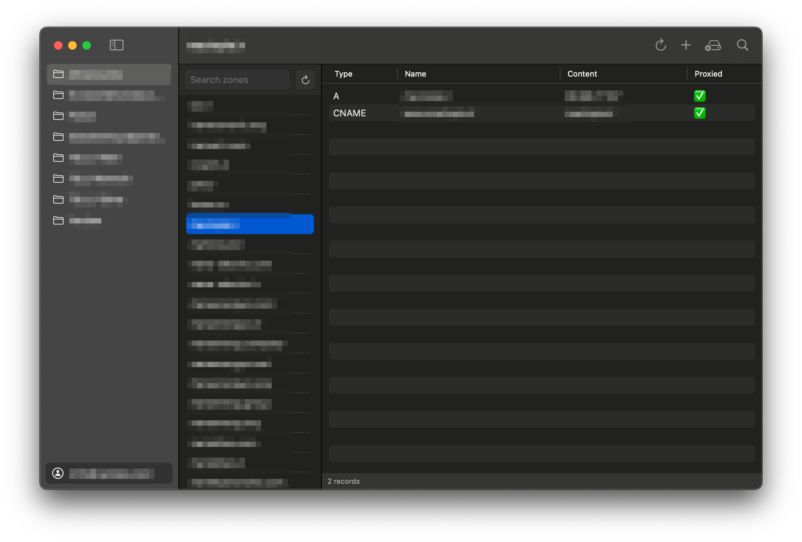

<p align="center">
  
  <br>
  <strong style="font-size: 40px">Cloudvia</strong>

  
</p>

# 🌐 Cloudvia

Cloudvia is a modern and lightweight **native Cloudflare client for macOS**, designed to help you manage your [Cloudflare](https://cloudflare.com) DNS zones and records easily with a clean, native macOS interface.

---

## ✨ Features

- View and manage all your Cloudflare DNS zones.
- List, add, edit, and delete DNS records within a selected zone.
- Fast search and filtering of zones and records.
- Native macOS UI with sidebar navigation.
- Clean, minimalistic, and beautiful design optimized for macOS.

---

## 🛠 Requirements

- macOS 13.0 (Ventura) or later
- Xcode 15 or later
- A Cloudflare API Key + Email

---

## 🔒 Privacy & Security

All sensitive data, including your Cloudflare API credentials, are securely stored locally on your device and are **never transmitted to any external servers**.

---

## 🚀 Getting Started

1. Clone the repository:

   ```bash
   git clone https://github.com/mehrdd/cloudvia.git
   cd cloudvia
   ```

---

## 📦 Download

Download the latest version of **Cloudvia** for macOS:

[⬇️ Download Cloudvia](https://github.com/mehrdd/Cloudvia/releases/download/1.0/Cloudvia.app.zip)
